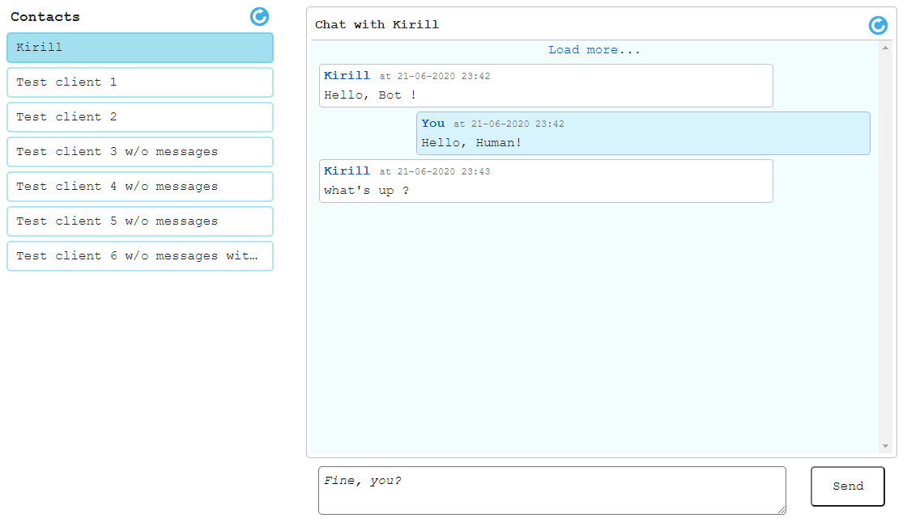

## Telegram bot 

The app consists of REST API that can be used to work with the clients of the telegram bot and web UI.

Server-side stack: Java 8, Spring Boot 2 (core, data-jpa, web, security), Maven, RDBMS (H2 in-memory DB).

Frontend stack: Typescript, React (template is based on Create React App), Redux, redux-thunk.

#### In order to run you have to have installed:
* Java 8
* Maven 3
```
mvn clean install -P frontend
cd target  
java -jar telegram-bot.jar
```
or 

* Docker

````
docker build --tag=app .
docker run -p 8080:8080 app
````

##### Warning: 
* 1\. You will need to specify your bot secret key in `application.yml`.
* 2\. Frontend is installed by Maven plugin (you need to enable `frontend` profile) that downloads node and npm and uses it to generate build files. 
      The build files are moved to `static` folder by another plugin.

For development you can run back and front separately. Dev server uses the proxy setting to send requests.

#### API 

After installation and launch the App is available on http://localhost:8080. First, you need to log in. 
The credentials are `admin/pass`. 

All endpoints start with `/api` prefix, e.g. [http://localhost:8080/api/clients](http://localhost:8080/api/clients)

##### Notes:
* 1\. UI for chatting wasn't developed as a real-time system. Therefore there are dedicated buttons to fetch updates to refresh the contact list and the messages of the client.
* 2\. The App has some initial test data (clients and their messages) but obviously it's impossible to send/receive anything from them :)

##### Screenshot of the app

